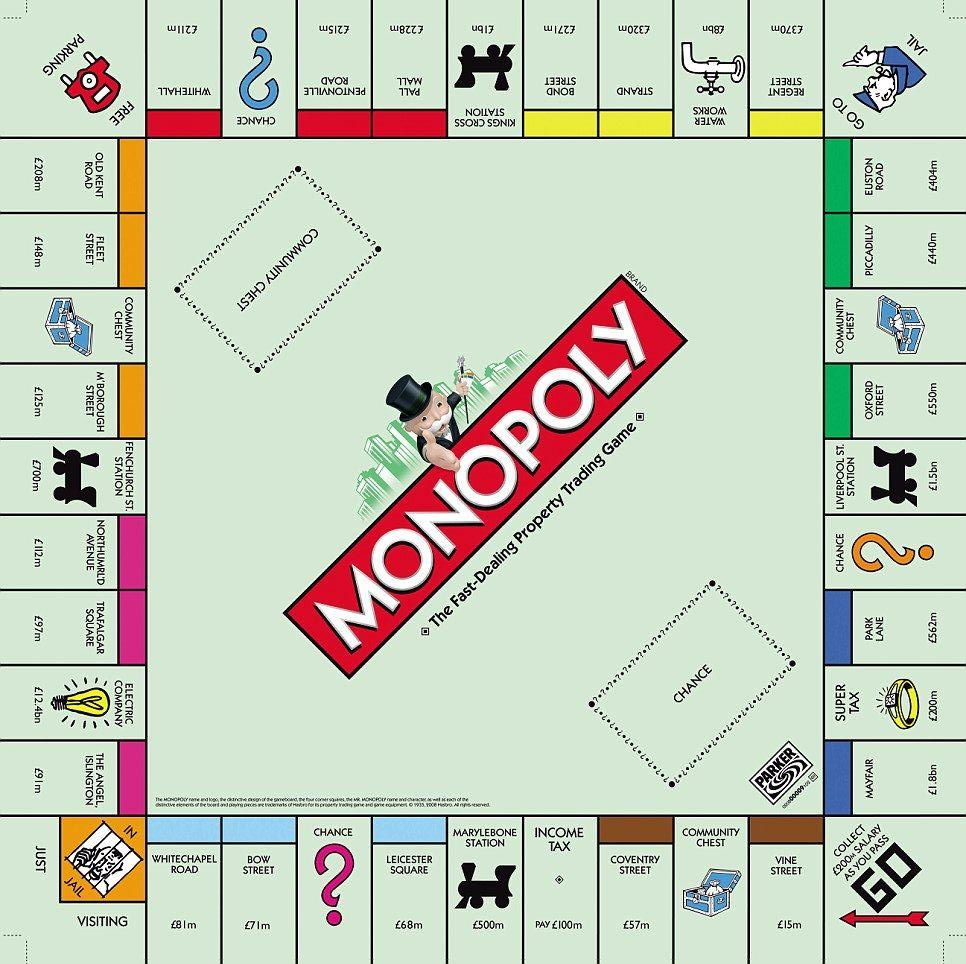

Welcome to my project of Monopoly.

Report of creation, thought process and sucess of project: [Report](MonopolyReport.pdf)

To run the program I have included a make file.
However SFML will need to be installed first.

For Fedora, Linux this should be typed into the terminal

sudo dnf install SFML-devel

please make sure it is installed to a standard path.

For more on SFML and linux: https://www.sfml-dev.org/tutorials/2.5/start-linux.php

For other operating systems please have a look: https://www.sfml-dev.org/download.php

Open Zip file 'monopoly project' in visual code, make sure SFML-devel is installed

Open new terminal.

Type make in your terminal and it should run the application. 

RULES

Each player gets 2000.
When a player runs out of money they go bankrupt, if one player is left its game over.
Dice roll by pressing dice button.
If a double is rolled, get another go. If three doubles rolled in a row, go to jail.
A player can buy a property when landed on it for a fee
If a player lands on a property which is already owned they pay rent.
Rent increases when all properties of the same colour are owned,
houses can only be bought when all same colour properties owned which increases rent.
Train stations rent is changed by 50 for each one owned by a singular playeer.
When laned on an owned company you pay what you rolled, if both companies are owned then pay 10x your roll.
If land on go to jail, go to jail and only get out after 3 goes or a doublle rolled.
If pass go/land on get 200.

Have fun!
